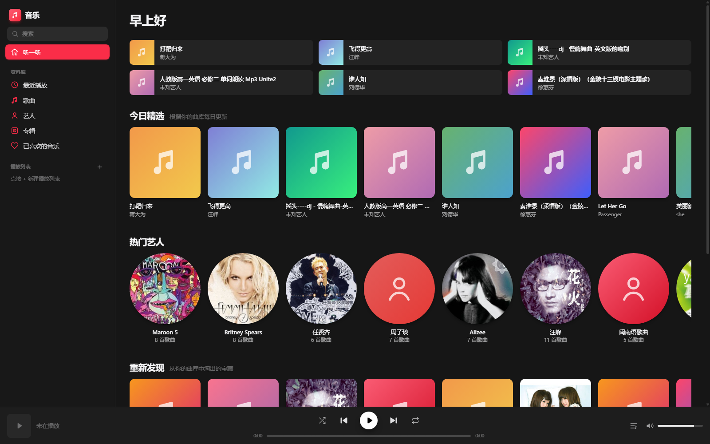

# 音乐 — 本地曲库播放器

[](https://bosswenwu.github.io/music-player/)
[](https://github.com/bosswenwu/music-player/actions/workflows/pages.yml)

Apple Music 风格播放器。别人打开网页后点「选择音乐文件夹」，播的是**他们自己电脑里的歌**，不会播你的曲库，文件也不会上传。

- 网页：<https://bosswenwu.github.io/music-player/>
- Windows 软件：安装包在 Releases，或运行 `npm run dist:win`



## 网页怎么用

1. 打开上面的链接
2. 点 **选择音乐文件夹**
3. 选中自己的歌曲目录，马上播放

## Windows 软件

安装后桌面会出现 **音乐** 快捷方式。首次如果本机已有 `F:\照片\KuGou` 会自动载入；否则同样点「选择音乐文件夹」。

```bash
npm install
npm run dist:win
```

生成的安装包在 `release/`。

## 本地开发

```bash
npm install
npm run scan
npm run dev
```
